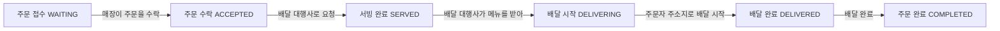
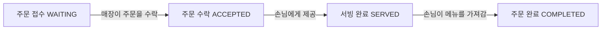
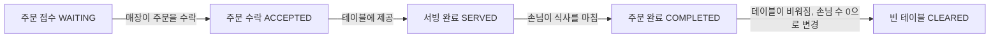

# 키친포스

## 퀵 스타트

```sh
cd docker
docker compose -p kitchenpos up -d
```

## 요구 사항

### 상품

- 상품을 등록할 수 있다.
- 상품의 가격이 올바르지 않으면 등록할 수 없다.
    - 상품의 가격은 0원 이상이어야 한다.
- 상품의 이름이 올바르지 않으면 등록할 수 없다.
    - 상품의 이름에는 비속어가 포함될 수 없다.
- 상품의 가격을 변경할 수 있다.
- 상품의 가격이 올바르지 않으면 변경할 수 없다.
    - 상품의 가격은 0원 이상이어야 한다.
- 상품의 가격이 변경될 때 메뉴의 가격이 메뉴에 속한 상품 금액의 합보다 크면 메뉴가 숨겨진다.
- 상품의 목록을 조회할 수 있다.

### 메뉴 그룹

- 메뉴 그룹을 등록할 수 있다.
- 메뉴 그룹의 이름이 올바르지 않으면 등록할 수 없다.
    - 메뉴 그룹의 이름은 비워 둘 수 없다.
- 메뉴 그룹의 목록을 조회할 수 있다.

### 메뉴

- 1 개 이상의 등록된 상품으로 메뉴를 등록할 수 있다.
- 상품이 없으면 등록할 수 없다.
- 메뉴에 속한 상품의 수량은 0 이상이어야 한다.
- 메뉴의 가격이 올바르지 않으면 등록할 수 없다.
    - 메뉴의 가격은 0원 이상이어야 한다.
- 메뉴에 속한 상품 금액의 합은 메뉴의 가격보다 크거나 같아야 한다.
- 메뉴는 특정 메뉴 그룹에 속해야 한다.
- 메뉴의 이름이 올바르지 않으면 등록할 수 없다.
    - 메뉴의 이름에는 비속어가 포함될 수 없다.
- 메뉴의 가격을 변경할 수 있다.
- 메뉴의 가격이 올바르지 않으면 변경할 수 없다.
    - 메뉴의 가격은 0원 이상이어야 한다.
- 메뉴에 속한 상품 금액의 합은 메뉴의 가격보다 크거나 같아야 한다.
- 메뉴를 노출할 수 있다.
- 메뉴의 가격이 메뉴에 속한 상품 금액의 합보다 높을 경우 메뉴를 노출할 수 없다.
- 메뉴를 숨길 수 있다.
- 메뉴의 목록을 조회할 수 있다.

### 주문 테이블

- 주문 테이블을 등록할 수 있다.
- 주문 테이블의 이름이 올바르지 않으면 등록할 수 없다.
    - 주문 테이블의 이름은 비워 둘 수 없다.
- 빈 테이블을 해지할 수 있다.
- 빈 테이블로 설정할 수 있다.
- 완료되지 않은 주문이 있는 주문 테이블은 빈 테이블로 설정할 수 없다.
- 방문한 손님 수를 변경할 수 있다.
- 방문한 손님 수가 올바르지 않으면 변경할 수 없다.
    - 방문한 손님 수는 0 이상이어야 한다.
- 빈 테이블은 방문한 손님 수를 변경할 수 없다.
- 주문 테이블의 목록을 조회할 수 있다.

### 주문

- 1개 이상의 등록된 메뉴로 배달 주문을 등록할 수 있다.
- 1개 이상의 등록된 메뉴로 포장 주문을 등록할 수 있다.
- 1개 이상의 등록된 메뉴로 매장 주문을 등록할 수 있다.
- 주문 유형이 올바르지 않으면 등록할 수 없다.
- 메뉴가 없으면 등록할 수 없다.
- 매장 주문은 주문 항목의 수량이 0 미만일 수 있다.
- 매장 주문을 제외한 주문의 경우 주문 항목의 수량은 0 이상이어야 한다.
- 배달 주소가 올바르지 않으면 배달 주문을 등록할 수 없다.
    - 배달 주소는 비워 둘 수 없다.
- 빈 테이블에는 매장 주문을 등록할 수 없다.
- 숨겨진 메뉴는 주문할 수 없다.
- 주문한 메뉴의 가격은 실제 메뉴 가격과 일치해야 한다.
- 주문을 접수한다.
- 접수 대기 중인 주문만 접수할 수 있다.
- 배달 주문을 접수되면 배달 대행사를 호출한다.
- 주문을 서빙한다.
- 접수된 주문만 서빙할 수 있다.
- 주문을 배달한다.
- 배달 주문만 배달할 수 있다.
- 서빙된 주문만 배달할 수 있다.
- 주문을 배달 완료한다.
- 배달 중인 주문만 배달 완료할 수 있다.
- 주문을 완료한다.
- 배달 주문의 경우 배달 완료된 주문만 완료할 수 있다.
- 포장 및 매장 주문의 경우 서빙된 주문만 완료할 수 있다.
- 주문 테이블의 모든 매장 주문이 완료되면 빈 테이블로 설정한다.
- 완료되지 않은 매장 주문이 있는 주문 테이블은 빈 테이블로 설정하지 않는다.
- 주문 목록을 조회할 수 있다.

## 용어 사전

### 공통

| 한글명 | 영문명       | 설명                                           |
|-----|-----------|----------------------------------------------|
| 고객  | user      | - 키친포스 이용자를 의미한다. <br> - (손님/사장님)으로 구분할 수 있다. |
| 손님  | customer  | - 키친포스를 이용하여 주문하는 고객을 뜻한다.                   |
| 사장님 | manager   | - 키친포스 내 매장의 메뉴를 관리하는 고객을 뜻한다.               |
| 매장  | restaurant | - 손님이 방문하여 매장 주문을 할 수 있는 장소                  |
| 비속어 | profanity | - 욕설과 외설성의 의미를 가진 단어를 의미한다.                  |

### 상품

| 한글명   | 영문명            | 설명                                                                                                           |
|-------|----------------|--------------------------------------------------------------------------------------------------------------|
| 상품    | product        | - 메뉴의 항목을 의미한다. <br> - 아메리카노, 바닐라라떼, 자몽에이드 등 개별 항목을 의미한다.                                                    |
| 상품 이름 | product name   | - 상품을 표현하는 이름으로, 등록할 때 필요하다. (단, 비속어 포함 불가)                                                                  |
| 상품 가격 | product price  | - 상품 가격으로, 0원 이상 등록이 되어야 한다. <br> - 가격은 상품 등록 후 변경이 가능하다. (단, 메뉴에 속한 경우 메뉴 가격이 메뉴에 속한 상품 금액의 합보다 크면 메뉴가 숨겨짐.) |
| 상품 등록 | product create | - 상품을 사장님이 등록하는 것을 의미한다.                                                                                     |

### 메뉴 그룹
| 한글명   | 영문명        | 설명                                                                    |
|-------|------------|-----------------------------------------------------------------------|
| 메뉴 그룹 | menu group | - 메뉴들을 묶어서 표현하는 단위이다. <br> - 신상품, 인기 있는 상품, 커피, 에이드 등 메뉴들의 집합체를 의미한다. |

### 메뉴

| 한글명      | 영문명                  | 설명                                                                                                                                      |
|----------|----------------------|-----------------------------------------------------------------------------------------------------------------------------------------|
| 메뉴       | menu                 | - 사장님이 등록 후 손님이 주문할 수 있는 단위이며, 한 개 이상 상품으로 구성된다. <br> - 한 개 이상 상품으로 구성된다. <br> - 한 개의 메뉴 그룹에 속해있다.                                      |
| 메뉴 이름    | menu name            | - 메뉴을 표현한느 이름으로, 등록 시 필요하다. (단, 비속어 포함 불가)                                                                                              |
| 메뉴 가격    | menu price           | - 사장님이 등록할 수 있는 메뉴의 가격이다.  메뉴의 가격이 메뉴에 속한 상품 금액의 합보다 높을 경우 메뉴를 노출할 수 없다.                                                                |
| 메뉴 노출 상태 | menu display status  | - 메뉴의 노출 여부를 의미하며, 노출되거나 숨겨질 수 있다.                                                                                                      |
| 노출된 메뉴   | displayed menu       | - 손님이 키친포스 메뉴화면에서 해당 메뉴의 정보를 볼 수 있다는 것을 의미한다.                                                                                           |
| 숨겨진 메뉴   | undisplayed menu     | - 손님이 키친포스 메뉴화면에서 해당 메뉴의 정보를 볼 수 없다는 것을 의미한다.  <br> - 사장님이 직접 해당 메뉴를 숨길 수 있다. <br> - 메뉴의 포함된 상품의 가격을 변경 시 메뉴 가격이 구성 상품보다 크면 메뉴가 숨긴처리 된다. |
| 메뉴의 속한 상품 | menuProduct          | - 메뉴의 포함된 상품들을 의미한다.                                                                                                                    |
| 상품의 수량   | menuProduct quantity | - 메뉴의 속한 상품의 재고 수량을 의미한다.                                                                                                               |

### 주문테이블

| 한글명    | 영문명           | 설명                                                            |
|--------|---------------|---------------------------------------------------------------|
| 주문 테이블 | order table   | - 매장에서 관리되는 테이블로 매장 식사 손님용. 매장 식사 손님이 모든 식사를 마치는 경우 테이블을 치운다. |
| 착석 테이블 | sitting table | - 테이블에 손님이 앉아있는 상태를 표현한다.                                     |
| 빈 테이블  | cleared table | - 테이블을 치운 상태 또는 아직 손님이 착석하지 않는 상태의 테이블을 표현한다.                 |
| 손님 수  | numberOfGuests | - 착석 테이블 상태 시 손님이 테이블에 앉아있는 수를 의미한다.      

### 주문

| 한글명   | 영문명           | 설명                                                                                                                                                      |
|-------|---------------|---------------------------------------------------------------------------------------------------------------------------------------------------------|
| 주문    | order         | - 손님이 메뉴를 시키는 것으로, 배달 주문, 포장 주문, 매장 주문이 가능하다.                                                                                                           |
| 주문 메뉴 | orderLineItem | - 손님이 주문한 메뉴를 의미한다. 손님은 주문할 메뉴와 메뉴에 대한 수량을 선택한다.  <br> - 매장 주문을 제외한 주문은 주문 메뉴 항목의 수량이 1 이상이어야 한다. <br> - 매장 주문의 경우 다른 주문과 다르게 주문 메뉴 항목의 수량이 0 미만일 수 있다. |
| 주문 상태 | order status  | - 주문의 상태를 말하며, 주문 접수(WAITING), 주문 수락(ACCEPTED), 서빙 완료(SERVED), 배달 중(DELIVERING), 배달 완료(DELIVERED), 주문 완료(COMPLETED)                                     |
| 서빙 완료 | served        | - 배달/포장 주문: 음식 조리 및 포장까지 완료된 상태를 말한다. <br> - 매장 주문: 음식 조리가 끝나 손님에게 전달할 수 있는 상태를 말한다.                                                                                                                                                                                   |

#### 배달주문

| 한글명      | 영문명               | 설명                                                                                 |
|----------|-------------------|------------------------------------------------------------------------------------|
| 배달 주문    | delivery          | - 손님이 입력한 배달 주소로 배달 대행사를 통해 배달해주는 주문. <br> - 배달 주소가 있어야 하며, 주문 후 전체 또는 부분 취소가 불가능하다. |
| 배달 주소    | delivery address  | - 배달 주문한 손님이 음식을 받는 위치를 의미한다.                                                      |
| 배달 대행사   | delivery rider    | - 배달 주소로 메뉴를 전달해주는 대행사. <br> - 배달 대행사 수락이 안되는 경우, 배달 접수가 안된다.                      |
| 주문 상태 흐름 | order status flow | - 주문 접수 → 주문 수락 → 서빙 완료 → 배달 중 → 배달 완료 → 주문 완료                      |

#### 포장주문

| 한글명   | 영문명     | 설명                                                       |
|-------|---------|----------------------------------------------------------|
| 포장 주문 | takeout | - 손님이 매장에 방문하여 포장해가는 주문. <br> - 주문 후 전체 또는 부분 취소가 불가능하다. |
| 주문 상태 흐름 | order status flow | - 주문 접수 → 주문 수락 → 서빙 완료 → 주문 완료                      |

#### 매장주문

| 한글명   | 영문명    | 설명                                                                                                     |
|-------|--------|--------------------------------------------------------------------------------------------------------|
| 매장 주문 | eat in | - 손님이 매장에 방문하여 주문 테이블에 앉아 식사하는 주문. <br> - 비어있는 주문 테이블이 없는 경우 주문이 불가능하다. <br> - 주문 후 전체 또는 부분 취소가 가능하다. |
| 주문 상태 흐름 | order status flow | - 주문 접수 → 주문 수락 → 서빙 완료 → 주문 완료                     |


## 모델링

### 상품(Product)
- 속성 
  - 비속어(Profanity)가 포함되지 않는 이름(name)을 가진다. 
  - 0원 이상인 가격(price)을 가진다.
  - 공통적으로 가격(price)는 원(won) 단위로 소수점 없이 1원 기준으로 표현한다. 
    - BigDecimal을 이용해 long형 보다 큰 범위의 수의 값을 다루기 위해 사용한다.

- 기능 
  - 상품을 등록(create)할 수 있다.
    - 상품의 이름(name)에 비속어(Profanity)가 포함되면 안된다.
    - 상품의 가격(price)는 0원 이상이어야한다. 
  - 상품의 가격(price)을 변경(change)할 수 있다.
    - 변경할 상품의 가격(price)는 0원 이상이어야 한다. 
    - 변경된 상품이 포함된 메뉴의 가격이 메뉴에 속한 상품(MenuProduct)가격의 합보다 크면 숨겨진 메뉴(undisplayed menu)가 된다.   
  - 상품의 목록을 조회(findAll) 할 수 있다.

### 메뉴그룹(MenuGroup)
- 속성 
  - 이름(name)을 비워 둘 수 없다.
  - 메뉴들을 묶는 단위로 사용된다.
    - 메뉴그룹과 메뉴는 1:N 관계이다.

- 기능 
  - 메뉴그룹을 등록(create)할 수 있다. 
    - 메뉴그룹의 이름(name)은 비워 둘 수 없다.
  - 메뉴그룹의 목록을 조회(findAll)할 수 있다.


### 메뉴(Menu)
- 속성 
  - 1개 이상의 상품(Product)을 갖는다.
    - 메뉴와 상품의 관계는 1:N 관계이다.
  - 상품의 수량(quantity)은 0이상이어야한다.
  - 특정 메뉴그룹(MenuGroup)의 포함되어야 한다.
  - 메뉴 노출 여부(display)를 지정할 수 있다.
  - 비속어(Profanity)가 포함되지 않는 이름(name)을 가진다. 
  - 0원 이상의 가격(price)를 갖는다.

- 기능 
  - 메뉴를 등록(create)할 수 있다. 
    - 메뉴의 이름(name)에 비속어(Profanity)가 포함되면 안된다.
    - 메뉴의 가격(price)는 구성상품(MenuProduct)의 가격합보다 크면 안된다.
    - 반드시 1개 이상의 상품(Product)으로 구성되어야한다.
    - 반드시 특정 메뉴그룹(MenuGroup)에 포함되어야한다. 
    - 노출여부를 선택해야한다. (노출(displayed)/숨김(undisplayed))
  - 메뉴의 가격을 변경(change)할 수 있다. 
    - 변경 가격은 0원 이상이어야 한다. 
    - 변경 메뉴 가격이 구성상품(MenuProduct)의 가격합보다 크면 안된다.
  - 메뉴를 노출(displayed) 시킬 수 있다. 
    - 숨겨진 메뉴(undisplayed menu)를 노출된 메뉴(displayed menu)로 변경할 수 있다.
  - 메뉴를 숨김처리(undisplayed) 할 수 있다.
    - 노출된 메뉴(displayed menu)를 숨겨진 메뉴(undisplayed menu)로 변경할 수 있다.
  - 메뉴의 목록을 조회(findAll)할 수 있다.

### 주문(Order)
- 속성 
  - 주문유형(OrderType)을 가진다. 
    - 배달(DELIVERY), 포장(TAKEOUT), 매장식사(EAT_IN)
  - 주문 시 1개 이상의 주문정보(OrderLineItem)가 필요하다.
    - 주문과 주문정보는 1:N 관계이다.
    - 메뉴(Menu)와 메뉴에 대한 수량(quantity) 정보를 가진다.
    - 숨겨진 메뉴(undisplayed menu)는 선택할 수 없다.
  - 주문 시 주문상태(OrderStatus) 값을 가진다.  
    - 주문 접수(WAITING), 주문 수락(ACCEPTED), 서빙 완료(SERVED), 배달 중(DELIVERING), 배달 완료(DELIVERED), 주문 완료(COMPLETED) 이다.
    - 각 주문 상태는 주문유형 별 모델링을 확인한다.
  - 주문 유형에 따른 추가 정보를 요구한다. 
    - 배달(DELIVERY)에 경우 주소지(address) 정보가 필요하다. 
    - 매장식사(EAT_IN) 시 주문테이블(OrderTable) 정보가 필요하다.

#### 주문 유형 - 배달(DELIVERY)
- 속성 
  - 주문정보(OrderLine) 입력 시 반드시 주소지(address) 정보를 기입하여야 한다.

- 기능
  - 주문을 접수(create)한다. 
    - 주문 유형을 선택하여햐 한다. 여기선 배달(DELIVERY)을 의미한다. 
    - 주문정보(OrderLine)를 선택 또는 기입한다.
      - 메뉴(Menu)를 1개 이상 선택하여야 한다. 
        - 메뉴는 노출된 메뉴(displayed menu)여야 하며, 등록된 메뉴와 주문정보의 기입된 가격(price)가 반드시 동일하여햐 한다.
      - 메뉴의 주문 수량(quantity)은 0 미만일 수 없다.
      - 배달(DELIVERY)의 경우 손님이 받을 주소지(address) 정보가 필요한다.
    - 주문 상태(OrderStatus)는 주문 접수(WAITING) 상태가 된다. 
  - 매장은 손님의 주문 접수(WAITING)를 수락(accept)할 수 있다.
    - 주문의 상태가 주문 접수(WAITING)여야만 한다.
    - 배달(DELIVERY)의 경우 수락 시 배달 대행사(delivery rider)로 요청이 간다(requestDelivery).
    - 배달 대행사(delivery rider)에서 요청을 거절 시 주문 접수를 수락할 수 없다.
    - 주문 상태(OrderStatus)는 주문 수락(ACCEPTED) 상태가 된다
  - 메뉴가 배달 가능한 상태가 되어 배달 대행사에 제공(serve)된다.
    - 주문의 상태가 주문 접수(ACCEPTED)여야만 한다.
    - 주문 상태(OrderStatus)는 서빙 완료(SERVED) 상태가 된다
  - 배달 대행사는 메뉴를 받아 주문자 주소지(address)로 배달이 시작(startDelivery)할 수 있다.
    - 주문 유형이 배달(DELIVERY)이어야 한다. 
    - 주문의 상태가 서빙 완료(SERVED)여야만 한다.
    - 주문 상태(OrderStatus)는 배달 중(DELIVERING) 상태가 된다
  - 배달 대행사는 주문자 주소지(address)로 메뉴를 배달 완료(completeDelivery)한다.
    - 주문 유형이 배달(DELIVERY)이어야 한다.
    - 주문의 상태가 배달 중(DELIVERING)여야만 한다.
    - 주문 상태(OrderStatus)는 배달 완료(DELIVERED) 상태가 된다
  - 배달 완료 시 주문을 완료(complete)시킬 수 있다.
    - 배달(DELIVERY)시 주문의 상태가 배달 완료(DELIVERED)여야만 한다.
    - 주문 상태(OrderStatus)는 주문 완료(COMPLETED) 상태가 된다.

- 플로우 차트



#### 주문 유형 - 포장(TAKEOUT)
- 속성
  - 추가 입력 속성이 없다.

- 기능
  - 주문을 접수(create)한다.
    - 주문 유형을 선택하여햐 한다. 여기선 포장(TAKEOUT)을 의미한다.
    - 주문정보(OrderLine)를 선택 또는 기입한다.
      - 메뉴(Menu)를 1개 이상 선택하여야 한다.
        - 메뉴는 노출된 메뉴(displayed menu)여야 하며, 등록된 메뉴와 주문정보의 기입된 가격(price)가 반드시 동일하여햐 한다.
      - 메뉴의 주문 수량(quantity)은 0 미만일 수 없다.
    - 주문 상태(OrderStatus)는 주문 접수(WAITING) 상태가 된다.
  - 매장은 손님의 주문 접수(WAITING)를 수락(accept)할 수 있다.
    - 주문의 상태가 주문 접수(WAITING)여야만 한다.
    - 주문 상태(OrderStatus)는 주문 수락(ACCEPTED) 상태가 된다
  - 메뉴가 포장되어 손님이 가져갈 수 있는 상태가 되어 손님에서 제공(serve)된다.
    - 주문의 상태가 주문 접수(ACCEPTED)여야만 한다.
    - 주문 상태(OrderStatus)는 서빙 완료(SERVED) 상태가 된다
  - 손님이 정상적으로 포장된 메뉴를 가져간다면 주문을 완료(complete)시킬 수 있다.
    - 상태가 서빙 완료(SERVED)여야만 한다.
    - 주문 상태(OrderStatus)는 주문 완료(COMPLETED) 상태가 된다.

- 플로우 차트



#### 주문 유형 - 매장식사(EAT_IN)
- 속성
  - 주문테이블(OrderTable)의 정보가 필요하다. 
    - 주문테이블은 착석테이블(SitingTable)상태여야한다.
    - 테이블의 방문한 손님 수(numberOfGuests)를 반영하여야한다.
    - 주문과 주문테이블은 N:1 관계이다.

- 기능
  - 주문을 접수(create)한다.
    - 주문 유형을 선택하여햐 한다. 여기선 매장식사(EAT_IN)을 의미한다.
    - 주문정보(OrderLine)를 선택 또는 기입한다.
      - 메뉴(Menu)를 1개 이상 선택하여야 한다.
        - 메뉴는 노출된 메뉴(displayed menu)여야 하며, 등록된 메뉴와 주문정보의 기입된 가격(price)가 반드시 동일하여햐 한다.
    - 주문 상태(OrderStatus)는 주문 접수(WAITING) 상태가 된다.
  - 매장은 손님의 주문 접수(WAITING)를 수락(accept)할 수 있다.
    - 주문의 상태가 주문 접수(WAITING)여야만 한다.
    - 주문 상태(OrderStatus)는 주문 수락(ACCEPTED) 상태가 된다
  - 메뉴가 테이블에 제공(serve)된다.
    - 주문의 상태가 주문 접수(ACCEPTED)여야만 한다.
    - 주문 상태(OrderStatus)는 서빙 완료(SERVED) 상태가 된다
  - 손님이 식사를 마치고 테이블에 일어났을 경우, 주문을 완료(complete)시킬 수 있다.
    - 주문의 상태가 서빙 완료(SERVED)여야만 한다.
    - 주문 상태(OrderStatus)는 주문 완료(COMPLETED) 상태가 된다.
    - 주문 테이블이 빈 테이블(cleared table) 상태가 된다.
    - 주문 테이블의 손님 수(numberOfGuests)가 0으로 변경된다.

- 플로우 차트



#### 매장식사(EAT_IN) 용 - 주문 테이블(OrderTable)
- 속성
  - 이름(name)을 비워 둘 수 없다.
  - 테이블의 상태(occupied)
    - 빈 테이블(cleared table)
    - 착석 테이블(sitting table)
  - 착석 테이블 시 0명 이상의 방문한 손님 수(numberOfGuests)를 지정해야 한다.

- 기능
  - 주문 테이블을 등록(create)할 수 있다.
    - 주문 테이블의 이름(name)은 비워 둘 수 없다.
    - 등록 시 테이블의 상태(occupied)는 빈 테이블이며, 방문한 손님 수(numberOfGuests)는 0명이 된다.
  - 주문 테이블을 착석 테이블(sitting table) 상태로 변경할 수 있다.
    - 빈 테이블 상태에 테이블을 착석 테이블로 상태 변경한다.
  - 주문 테이블을 빈 테이블(cleared table) 상태로 변경 할 수 있다.
    - 착석 테이블을 빈 테이블 상태로 변경할 수 있다.
    - 빈 테이블 상태가 되면 방문한 손님 수도 0명으로 변경된다.
    - 단, 완료되지 않은 주문이 있는 테이블인 경우 빈 테이블 설정이 불가하다.
  - 주문 테이블의 방문한 손님 수를 변경(numberOfGuests)할 수 있다.
    - 방문한 손님 수는 0명 이상이어야 한다.
    - 주문 테이블의 상태가 착석 테이블이어야 한다.
  - 주문 테이블의 목록을 조회(findAll)할 수 있다.
